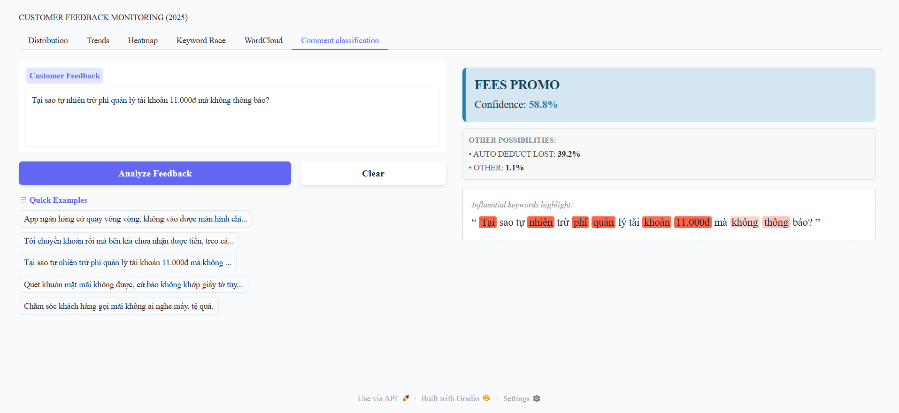
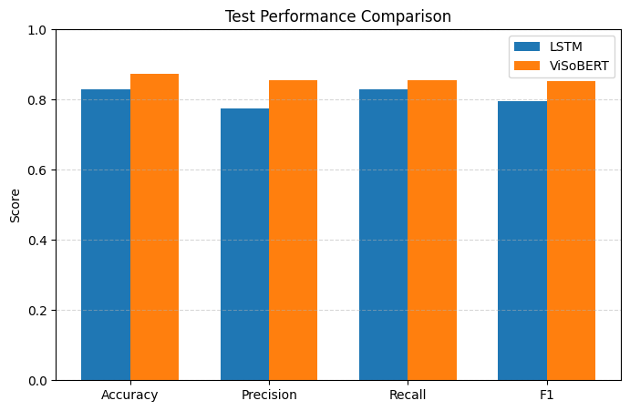
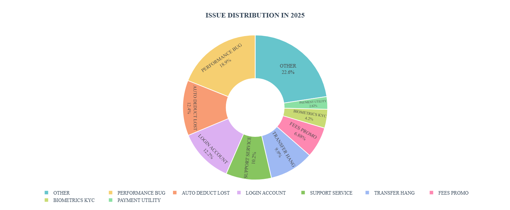
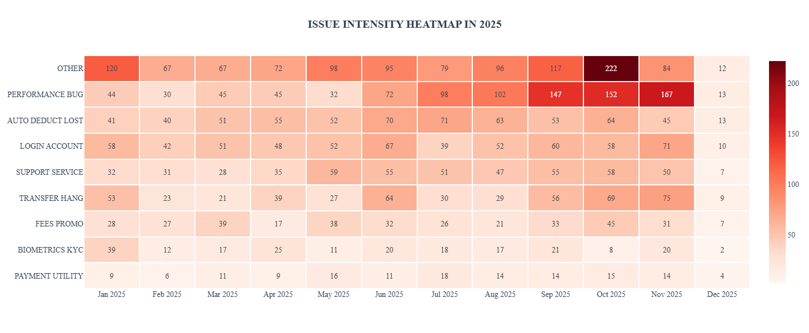
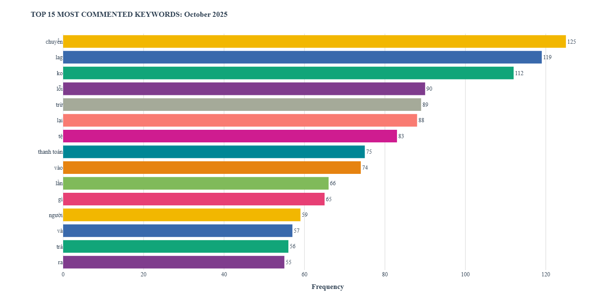
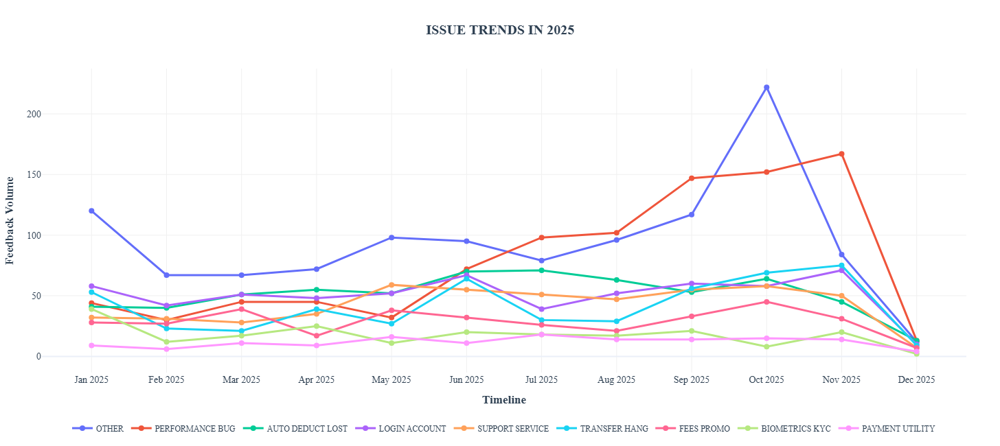
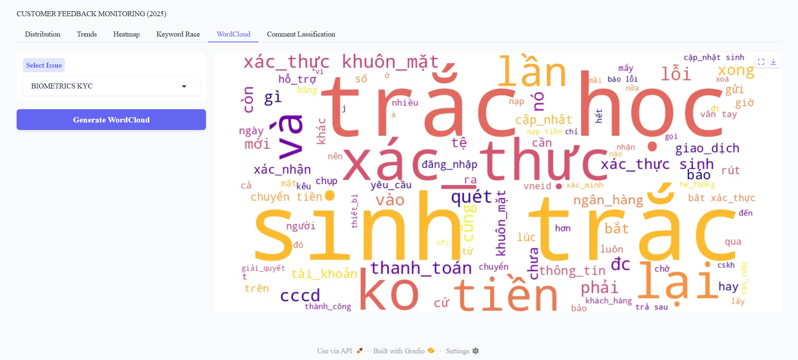
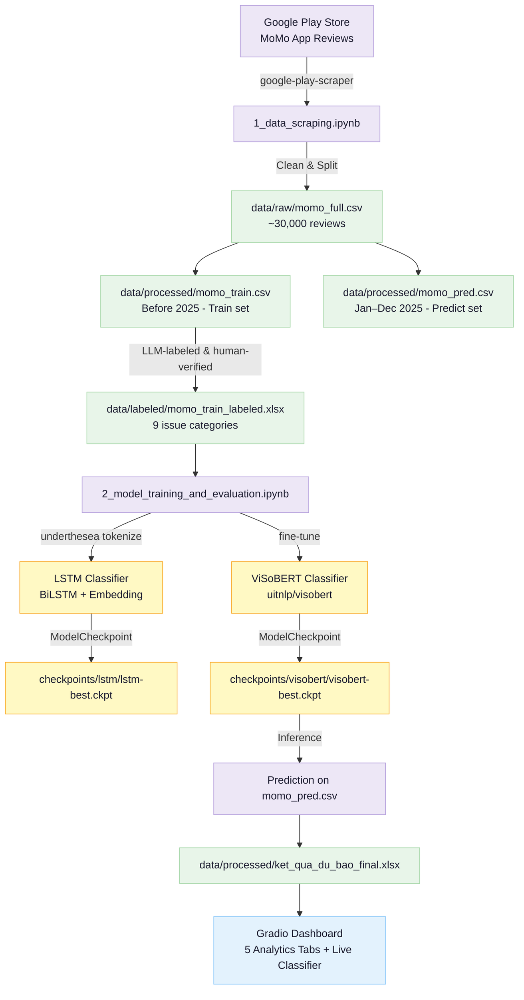

# Customer Feedback Classifier

**Đồ án môn Xử lý Ngôn ngữ Tự nhiên / Natural Language Processing Final Project**

Phân loại và phân tích phản hồi khách hàng MoMo từ Google Play Store thành 9 nhóm vấn đề, kết hợp dashboard trực quan và công cụ dự báo thời gian thực bằng ViSoBERT.

---

## Project Gallery


*Dashboard phân loại feedback theo thời gian thực với confidence score và keyword highlight / Real-time comment classification with confidence score & keyword importance*


*So sánh hiệu quả trên tập test / Model performance comparison*


*Phân bố 9 nhóm vấn đề của người dùng MoMo năm 2025 / Distribution of 9 issue categories in 2025*


*Heatmap cường độ vấn đề theo tháng / Monthly issue intensity heatmap*


*Top 15 từ khóa được đề cập nhiều nhất theo từng tháng / Top 15 most mentioned keywords per month*


*Xu hướng các nhóm vấn đề theo tháng trong năm 2025 / Monthly issue trend analysis 2025*


*WordCloud các từ khóa nổi bật theo từng nhóm vấn đề / WordCloud of keywords by issue category*

---

## Kiến trúc hệ thống / System Architecture



---

## 🇻🇳 Tiếng Việt

### 1. Giới thiệu

Dự án xây dựng hệ thống phân loại phản hồi khách hàng của ứng dụng **MoMo** từ Google Play Store, phân loại tự động vào **9 nhóm vấn đề** và trực quan hóa xu hướng theo thời gian thực qua dashboard Gradio. Hướng đến mục đích biết được đâu là chủ đề bị phản hồi tiêu cực nhiều nhất trong khoảng thời gian xác định, hỗ trợ quá trình sửa đổi và phát triển ứng dụng.

**9 nhóm vấn đề:**

| Nhãn | Mô tả |
|---|---|
| `AUTO_DEDUCT_LOST` | Bị trừ tiền tự động / mất tiền không rõ nguyên nhân |
| `BIOMETRICS_KYC` | Lỗi xác thực sinh trắc học, định danh KYC |
| `FEES_PROMO` | Phí giao dịch, khuyến mãi không áp dụng được |
| `LOGIN_ACCOUNT` | Không đăng nhập được, mất tài khoản |
| `OTHER` | Các vấn đề khác không phân loại được |
| `PAYMENT_UTILITY` | Lỗi thanh toán hóa đơn, dịch vụ tiện ích |
| `PERFORMANCE_BUG` | App chậm, treo, crash |
| `SUPPORT_SERVICE` | CSKH không hỗ trợ được, phản hồi chậm |
| `TRANSFER_HANG` | Chuyển tiền bị treo, không đến nơi nhận |

### 2. Công nghệ sử dụng

| Thành phần | Công nghệ |
|---|---|
| Thu thập dữ liệu | google-play-scraper |
| Tiền xử lý văn bản | underthesea, regex, unicodedata, emoji |
| Mô hình 1 | BiLSTM (PyTorch + PyTorch Lightning) |
| Mô hình 2 | ViSoBERT – uitnlp/visobert (HuggingFace Transformers) |
| Đánh giá | scikit-learn (Accuracy, Precision, Recall, F1, Confusion Matrix) |
| Dashboard | Gradio, Plotly, WordCloud, pyvi |
| Môi trường | Google Colab + Google Drive |

### 3. Pipeline

```
Thu thập data  →  Làm sạch  →  Gán nhãn bằng LLMs & kiểm tra lại  →  Train LSTM & ViSoBERT
      →  Đánh giá & So sánh  →  Dự báo tập 2025  →  Dashboard Gradio
```

### 4. Kết quả mô hình

| Model | Accuracy | Precision | Recall | F1-score |
|---|---|---|---|---|
| LSTM | 0.830 | 0.775 | 0.828 | 0.797 |
| ViSoBERT | 0.888 | 0.877 | 0.876 | 0.876 |

### 5. Tính năng Dashboard

| Tab | Mô tả |
|---|---|
| Distribution | Pie chart phân bố 9 nhóm vấn đề trong năm 2025 |
| Trends | Line chart xu hướng từng nhóm vấn đề theo tháng |
| Heatmap | Heatmap cường độ vấn đề theo nhóm × tháng |
| Keyword Race | Top 15 từ khóa nổi bật nhất theo từng tháng (slider) |
| WordCloud | WordCloud theo nhóm vấn đề tùy chọn |
| Comment Classification | Nhập feedback → dự báo nhóm vấn đề + confidence score + keyword highlight |

### 6. Cách chạy

#### Bước 1 — Thu thập dữ liệu
Mở `notebooks/1_data_scraping.ipynb` trên Google Colab, chạy toàn bộ (Runtime → Run all).

Output:
```
data/raw/momo_full.csv
data/processed/momo_train.csv
data/processed/momo_pred.csv
```

#### Bước 2 — Gán nhãn bằng LLMs
Đưa `data/processed/momo_train.csv` vào LLMs (ChatGPT hoặc tương tự) để gán nhãn tự động vào 9 nhóm vấn đề, kiểm tra lại thủ công, lưu thành:
```
data/labeled/momo_train_labeled.xlsx
```

#### Bước 3 — Train mô hình & chạy dashboard
Mở `notebooks/2_model_training_and_evaluation.ipynb` trên Google Colab **(bật GPU: Runtime → Change runtime type → T4 GPU)**, chạy toàn bộ (Runtime → Run all).

> ⚠️ **Lưu ý:** Cần upload `momo_train_labeled.xlsx` vào đúng thư mục `data/labeled/` trên Google Drive trước khi chạy.

---

## 🇬🇧 English

### 1. Introduction

This project builds an automated pipeline to classify **MoMo** app reviews from Google Play Store into **9 issue categories**, then visualizes trends through an interactive Gradio dashboard with real-time prediction. The goal is to identify which issue categories receive the most negative feedback within a defined time period, supporting app improvement and development decisions.

### 2. Tech Stack

| Component | Technology |
|---|---|
| Data Collection | google-play-scraper |
| Text Preprocessing | underthesea, regex, unicodedata, emoji |
| Model 1 | BiLSTM (PyTorch + PyTorch Lightning) |
| Model 2 | ViSoBERT – uitnlp/visobert (HuggingFace Transformers) |
| Evaluation | scikit-learn (Accuracy, Precision, Recall, F1, Confusion Matrix) |
| Dashboard | Gradio, Plotly, WordCloud, pyvi |
| Environment | Google Colab + Google Drive |

### 3. Model Results

| Model | Accuracy | Precision | Recall | F1-score |
|---|---|---|---|---|
| LSTM | 0.830 | 0.775 | 0.828 | 0.797 |
| ViSoBERT | 0.888 | 0.877 | 0.876 | 0.876 |

### 4. Key Features

| Tab | Description |
|---|---|
| Distribution | Pie chart of 9 issue categories in 2025 |
| Trends | Monthly line chart per issue category |
| Heatmap | Issue intensity heatmap by category × month |
| Keyword Race | Top 15 keywords per month with slider control |
| WordCloud | WordCloud filtered by issue category |
| Comment Classification | Live prediction with confidence score & keyword importance highlighting |

### 5. Quick Start

**Step 1 — Data Collection**
Open `notebooks/1_data_scraping.ipynb` on Google Colab → Runtime → Run all.

**Step 2 — LLM-based Labeling**
Feed `data/processed/momo_train.csv` into an LLM (e.g. ChatGPT) to auto-label into 9 issue categories, verify manually, then save as `data/labeled/momo_train_labeled.xlsx`.

**Step 3 — Train & Launch Dashboard**
Open `notebooks/2_model_training_and_evaluation.ipynb` on Google Colab **(enable GPU: Runtime → Change runtime type → T4 GPU)** → Runtime → Run all.

---

## 📁 Cấu trúc thư mục / Project Structure

```
Customer-Feedback-Classifier/
│
├── data/
│   ├── raw/                          # momo_full.csv (~30,000 reviews)
│   ├── labeled/                      # momo_train_labeled.xlsx (LLM-labeled & human-verified)
│   └── processed/                    # momo_train.csv, momo_pred.csv, ket_qua_du_bao_final.xlsx
│
├── cfc_img/                          # Screenshots for README
├── 1_data_scraping.ipynb             # Data collection & preprocessing
├── 2_model_training_and_evaluation.ipynb  # Model training, evaluation & dashboard
├── .gitignore
├── README.md
└── requirements.txt
```

---

## 📝 Ghi chú / Notes

- Dữ liệu thô và file checkpoint không được commit lên GitHub do kích thước lớn. Xem `.gitignore` để biết thêm chi tiết.
- Raw data and model checkpoints are not committed to GitHub due to file size. See `.gitignore` for details.
- Toàn bộ pipeline chạy trên Google Colab + Google Drive, không yêu cầu cài đặt môi trường local.
- The entire pipeline runs on Google Colab + Google Drive, no local environment setup required.
- Trước khi chạy, cần đổi biến `base` trong cả 2 notebook thành đường dẫn Google Drive của bạn:
```python
  base = '/content/drive/MyDrive/TÊN_THƯ_MỤC_CỦA_BẠN'
```
- Before running, update the `base` variable in both notebooks to match your Google Drive path:
```python
  base = '/content/drive/MyDrive/YOUR_FOLDER_NAME'
```
